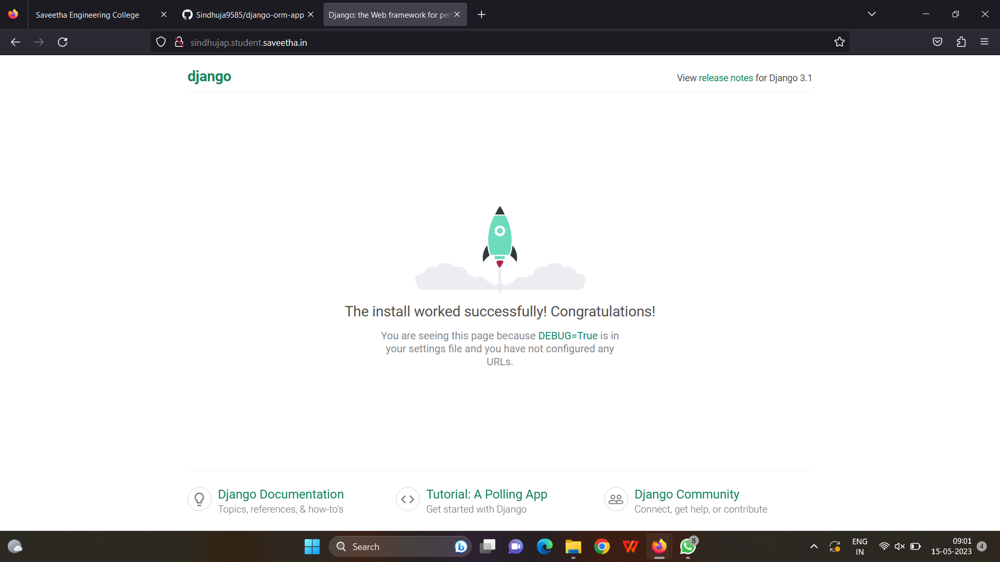
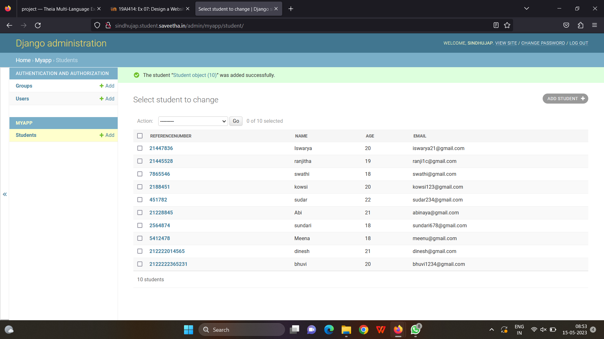

# Django ORM Web Application

## AIM
To develop a Django application to store and retrieve data from a database using Object Relational Mapping(ORM).

## Entity Relationship Diagram

## DESIGN STEPS

### STEP 1:
Clone the repository from github.

### STEP 2:
Create an admin interface For django.

### STEP 3:

Create an app and edit settings.py

### STEP 4:
Makemigrations and migrate changes

### STEP 5:
Create an admin user and write python code for admin and models.

### STEP 6:
Make all the migrations to my 'myapp'

### STEP 7:
Create an studentadmin database with 10 fields using runserver command

## PROGRAM
'''
admin.py
from django.contrib import admin
from .models import Student,StudentAdmin
# Register your models here.
admin.site.register(Student,StudentAdmin)

models.py
from django.db import models
from django.contrib import admin

# Create your models here.
class Student (models.Model):
    referencenumber=models.CharField(max_length=20,help_text="reference number")
    name=models.CharField(max_length=100)
    age=models.IntegerField()
    email=models.EmailField()

class StudentAdmin(admin.ModelAdmin):
    list_display=('referencenumber','name','age','email')

## OUTPUT

## RESULT
The program for creating an studentadmin database using ORM is executed successfully.
